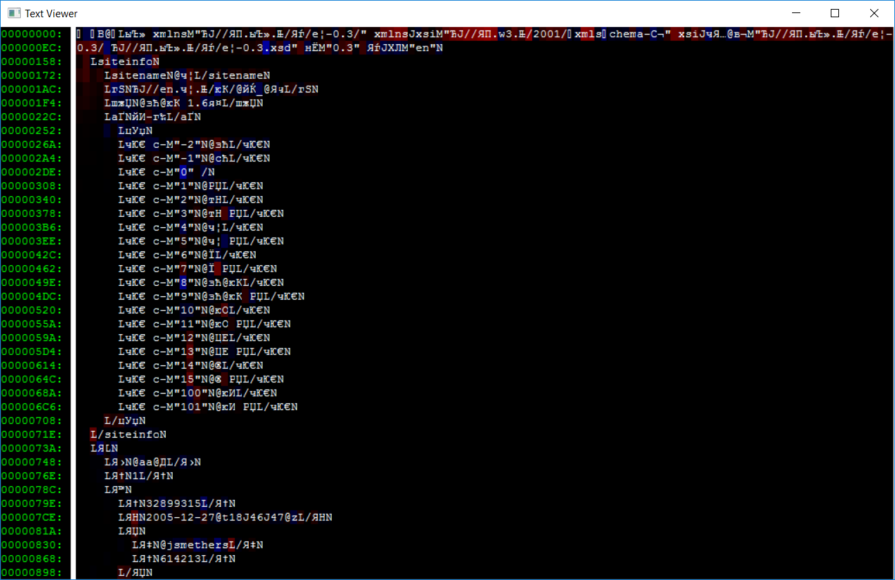

# markup_view
viewer for text with color attributes



## Command-line Syntax

```
textview.exe [/1|/2] <filename>
```

**Options:**
- `/1` - Grayscale palette mode (default)
- `/2` - Red/Blue diff palette mode

**File Format:**
The input file must contain text with color attributes in the following format:
- Each character occupies 2 bytes:
  - Byte 0: ASCII character code
  - Byte 1: Color attribute value (0x00-0xFF)
- File size must be even (each character has exactly one attribute byte)
- Newline characters (`\n`) separate paragraphs
- The viewer displays the text with background colors determined by the attribute values

## Window Controls and Keys

**Keyboard Controls:**
- `ESC` - Exit the application
- `F2` - Toggle between palette modes (/1 and /2)
- `+` (Plus/Add) - Increase window width (max 200 characters)
- `-` (Minus/Subtract) - Decrease window width (min 20 characters)
- `Arrow Keys` (←↑↓→) - Navigate left, up, down, right by one line/column
- `Page Up` - Scroll up by one screen height
- `Page Down` - Scroll down by one screen height
- `Home` - Jump to the beginning of the document
- `End` - Jump to the end of the document

**Mouse Controls:**
- `Mouse Wheel` - Scroll vertically (3 lines per wheel notch)
- `Horizontal Mouse Wheel` - Scroll horizontally (3 columns per wheel notch)
- Window resizing automatically adjusts the grid dimensions

## Palette Modes

### /1 Palette (Grayscale)
The default palette mode where the attribute byte directly controls brightness:
- Color mapping: `RGB(attr, attr, attr)`
- **Higher attribute values = brighter background**
- Range: 0x00 (black) to 0xFF (white)
- Useful for viewing general markup with varying intensity levels

### /2 Palette (Red/Blue Diff)
A specialized palette designed for diff files, using a diverging color scheme:
- **0x80** = Neutral/unchanged (black background)
- **Above 0x80** = Additions/increases (red background, intensity increases with value)
  - Color mapping: `RGB((attr-128)*255/127, 0, 0)`
- **Below 0x80** = Deletions/decreases (blue background, intensity increases as value decreases)
  - Color mapping: `RGB(0, 0, (127-attr)*255/127)`

The attribute value for diff mode is calculated as: `min(0xFF, max(0x00, (0x80 + attr1 - attr2)))`
where `attr1` and `attr2` are the attribute values being compared.
